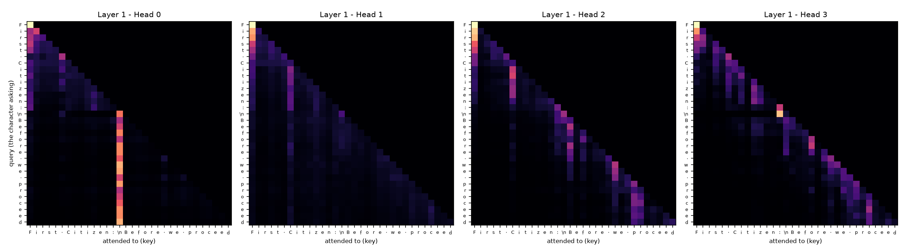
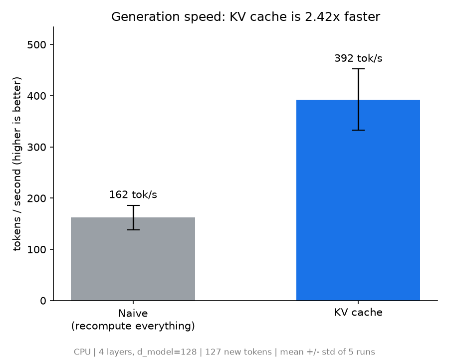

# transformer-internals

A decoder-only Transformer (GPT-style) written in PyTorch without `nn.MultiheadAttention` or `nn.TransformerEncoderLayer`: tokenizer, batching, self-attention, multi-head attention, positional embeddings, pre-LN blocks, training loop, sampling, **attention heatmaps** and a **KV cache with a measured benchmark**. Every stage has a short write-up of what I learned in `docs/notes/`.

Trained as a character-level language model on Tiny Shakespeare, on a laptop CPU.

## Results

**Training** (4 layers, 4 heads, d_model 128, block size 128, 824,897 parameters, 3000 steps on CPU)

| step | train loss | val loss |
|---|---|---|
| 0 | 4.177 | 4.173 |
| 1000 | 2.065 | 2.107 |
| 2000 | 1.708 | 1.846 |
| 3000 | 1.545 | 1.722 |

The starting loss matches ln(65) = 4.17, which is what a model guessing uniformly over 65 characters should score. The train/val gap widening toward the end is the first sign of overfitting.

**Sample** (temperature 0.8, unprompted)

```
GREY:
What for a pray! Hargeth is love compastion
of doys risons storth trumes conters
Shall of you dead die: speak.

ANGELO:
I am was did to all on why need to peace
The drown subjectures and his than many part,
```

The model has learned the play format, Elizabethan vocabulary and mostly correct spelling. It has not learned meaning, which is expected at this size.

**Attention maps** (every head in every layer, for one prompt). Layer 0 has a near-pure diagonal head and some diffuse heads. Layers 1 and 2 add heads that look at the last few characters and heads with vertical stripes, and layer 3 is sparse. The upper triangle is zero because of the causal mask.



More in `results/attention_maps/`.

**KV cache.** Cached generation is **2.4x faster** than recomputing the whole context at every step (162 → 392 tokens/sec, mean of 5 alternating runs after a warm-up, CPU), and numerically equivalent to the full forward pass (max logit difference 4.8e-6).



## Run it

Run everything from the project root.

```
pip install -r requirements.txt
python src/train.py                                  # trains, saves checkpoints/best.pt
python src/generate.py --prompt "ROMEO:" --temperature 0.8
python viz/attention_heatmap.py                      # saves results/attention_maps/
python src/kv_cache.py                               # equivalence check + benchmark
python viz/benchmark_plot.py                         # saves results/kv_cache_benchmark.png
```

## Layout

```
src/
  tokenizer.py            character-level encode/decode
  dataset.py              random (input, target) batches
  attention.py            single-head causal self-attention
  multihead_attention.py  parallel heads + output projection
  positional_encoding.py  learned embeddings (plus a sinusoidal reference)
  transformer_block.py    pre-LN block: attention + feedforward + residuals
  model.py                full GPT
  train.py                training loop, checkpointing
  generate.py             sampling (temperature, top-k)
  kv_cache.py             cached generation, correctness check, benchmark
viz/                      attention heatmaps, benchmark plot
configs/config.yaml       hyperparameters
docs/notes/               one note per stage: questions I had and how I answered them
```

## Limitations

- A tiny character-level model trained for 3000 steps: the text looks like Shakespeare but is not coherent.
- The attention maps come from one short prompt, so they are observations, not general claims. Attention weights show where a head reads from, not proof that this information drove the output.
- The KV-cache speedup is for a small model on CPU, where Python overhead (a loop over every head) limits the gain. Cached generation works only up to `block_size` tokens, because positional embeddings are absolute.

## Credits

- Architecture learned from [this video series](https://www.youtube.com/playlist?list=PLkBMe2eZMRQ2VKEtoL0GVUrNzEiXfgj07).
- Dataset: Tiny Shakespeare, from Andrej Karpathy's `char-rnn` repository.
- Built while learning with Claude (Anthropic) as a tutor and pair programmer.